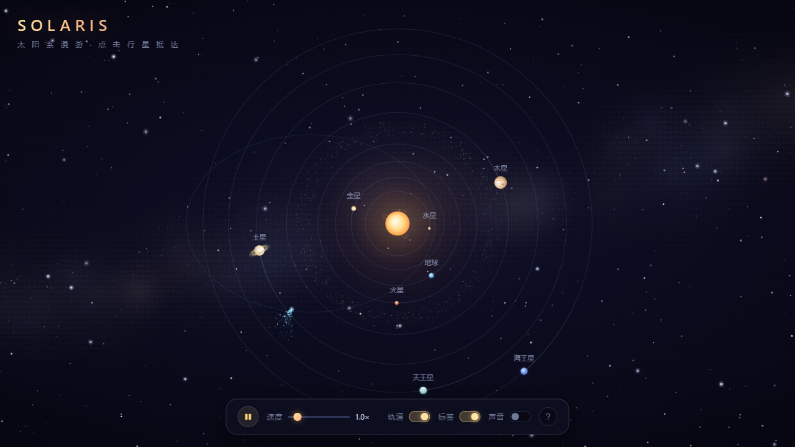
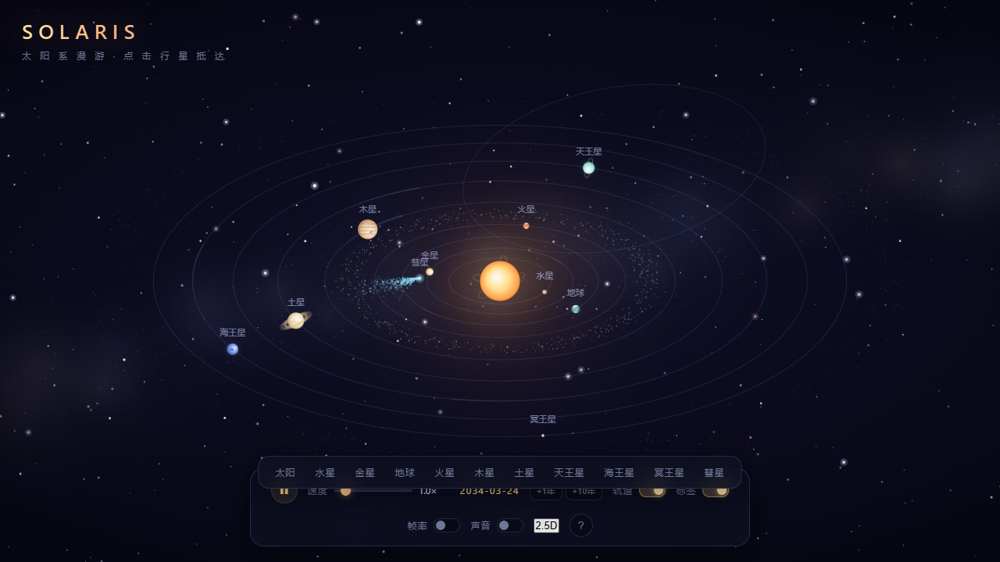
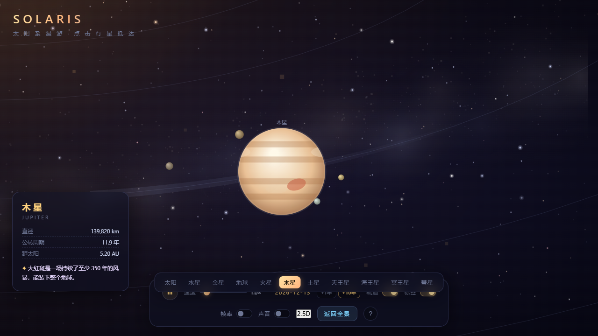
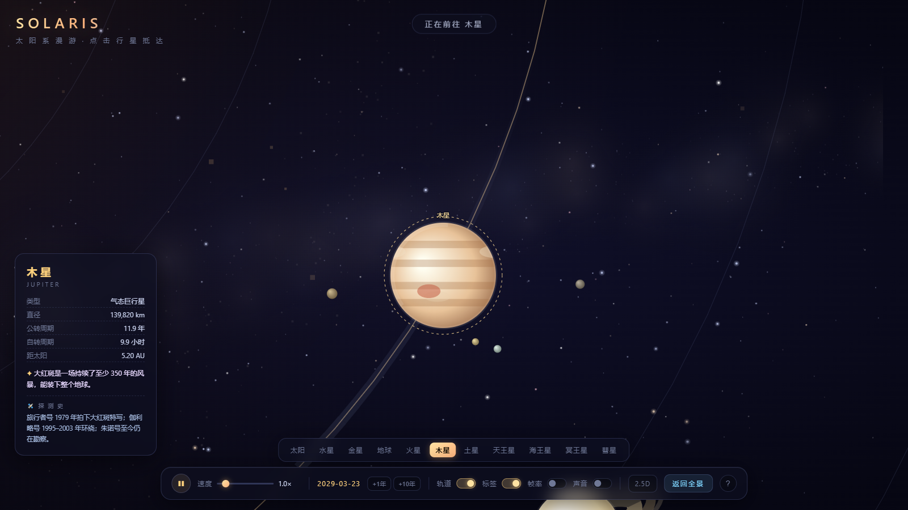
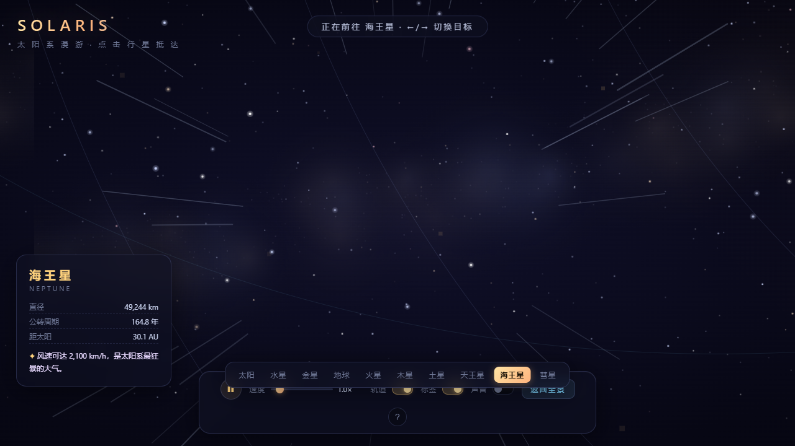
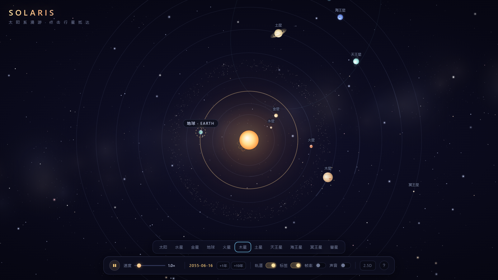

# SOLARIS · Interactive Solar System 🪐

> An interactive solar system built with pure native Canvas. Single file, zero dependencies, zero build — just download `index.html` and double-click.

**▶ [Live Demo (GitHub Pages)](https://miracle-tang.github.io/solar-system/)** ｜ [中文说明](README.md)

[](LICENSE)


## Preview

| Top-down view (galaxy + belts + comet) | 2.5D tilted view (staggered orbits, depth) |
|:---:|:---:|
|  |  |

| Follow + dossier (Galilean moons) | Target lock | Warp travel | Orbit highlight |
|:---:|:---:|:---:|:---:|
|  |  |  |  |

## ✨ Features

- **8 planets + Pluto**: lit-side radial gradients, Kepler-like orbital speeds, motion trails; surface markings drift with rotation (Earth continents + a separate drifting cloud layer, Venus retrograde, Mars polar caps, Neptune's Great Dark Spot), Jupiter's Great Red Spot orbits with the spin; day-side rim light; the sunlit hemisphere always faces the Sun (in 2.5D too)
- **Time freeze is real**: pausing halts spin, cloud drift, band ripple, corona pulse & prominences (simT/animT-driven)
- **2.5D view**: smooth transition between top-down disc and tilted perspective; each orbit oriented by its **real longitude of perihelion**
- **Moons**: Earth's Moon + the four Galilean moons of Jupiter; Uranus rolls on its side with a near-vertical ring
- **Details**: Saturn's 3-layer rings with occlusion, Jupiter's bands & Great Red Spot, asteroid belt (760), Kuiper belt (520)
- **Comet**: elliptical focus orbit (dθ/dt ∝ 1/r², accelerates at perihelion), anti-solar tail that brightens near the Sun, perihelion flash easter egg
- **Sun**: pulsing multi-layer corona, eruptive prominences, solar wind particles
- **Interaction**: click any body to fly & follow (lock animation, warp streaks on long jumps, dossier card); nav bar / `←` `→` cycling across 11 targets with a pentatonic note per body (hovering a nav button highlights that body on canvas); wheel / `+` `−` / pinch zoom (0.25×–10×); drag pans with UI fading out for immersion; simulated date (click to reset to today) + `+1y / +10y` time jumps; `V` toggles 2.5D; settings persist via localStorage; auto-mute when tab is hidden; honors `prefers-reduced-motion`
- **Audio**: 100% synthesized with Web Audio (ambient pad, whoosh, blips)

## 🕹 Controls

| Input | Action |
|---|---|
| Wheel / `+` `−` / pinch | Zoom (0.25×–10×) |
| Drag | Pan (UI fades out while dragging) |
| Click a body | Fly, follow & show dossier |
| Nav bar / `←` `→` | Switch target (hover to preview-highlight it on canvas) |
| `V` / 2.5D button | Toggle top-down ↔ tilted |
| `+1y` `+10y` | Time jump |
| Click the date | Back to today |
| `Esc` / click empty | Return to overview |
| `Space` | Pause |

## 🚀 Run

```bash
# Option 1: double-click index.html

# Option 2: any static server
python -m http.server 8000
# open http://127.0.0.1:8000
```

## 🛠 Technical Notes

- Pure Canvas 2D, no frameworks, everything in one `index.html` (~1400 lines, detailed Chinese comments)
- Coordinate pipeline: world plane → 2.5D projection (y compressed by tilt angle, smoothly animated) → screen
- Planet angular speed ∝ r^-1.5; comet uses a constant-area-rate approximation (dθ/dt ∝ 1/r²)
- Unified `fx` queue drives lock rings / perihelion flash; camera speed maps to warp streak intensity
- Pre-rendered parallax star layers, bounded particle counts, devicePixelRatio capped at 2× — solid 60fps
- All audio synthesized: detuned sine ambient pad, noise-buffer + band-pass whoosh

## 📊 Data

Dossier data (diameters, periods, distances) reference the [NASA Planetary Fact Sheet](https://nssdc.gsfc.nasa.gov/planetary/factsheet/). Orbit radii and periods are compressed for readability; the simulated date is synced to Earth's visual period and is illustrative only.

## License

[MIT](LICENSE) © Miracle-Tang
