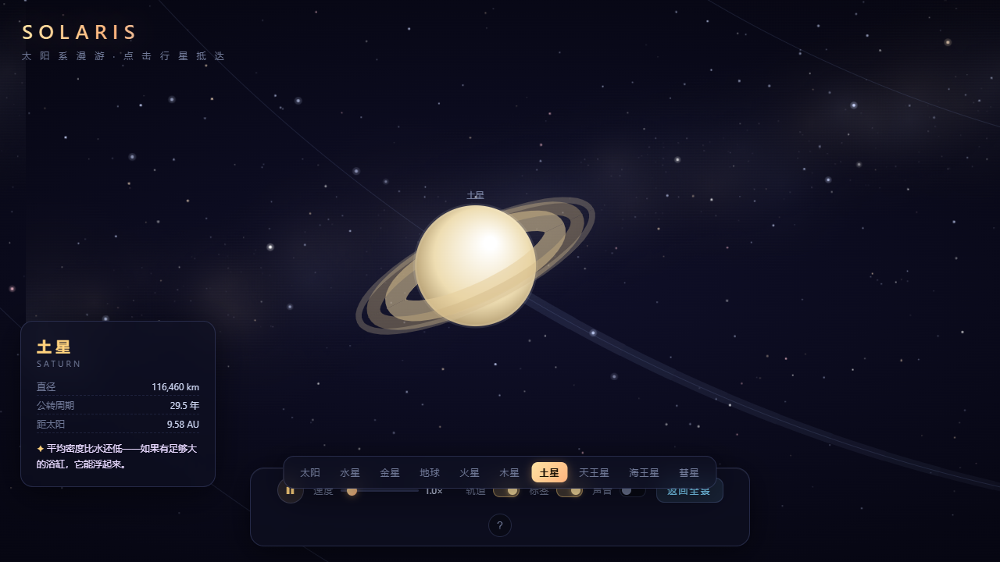
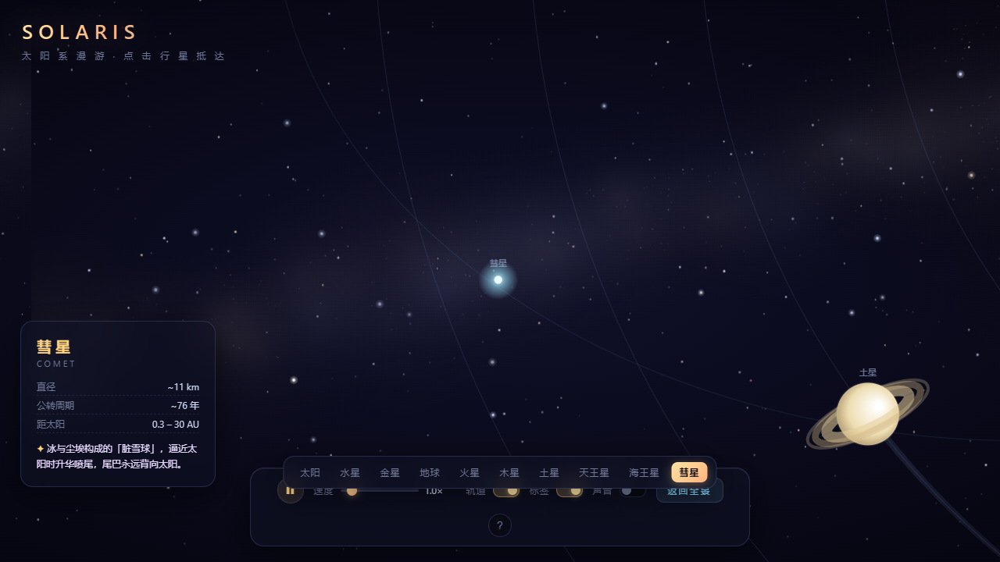

# SOLARIS · 太阳系漫游 🪐

> 一个纯原生 Canvas 打造的交互式太阳系动效网页。单文件、零依赖、零构建——下载 `index.html` 双击即用，无需服务器、无需网络。

[](LICENSE)


## 预览

| 全景（银河尘埃带 + 小行星带 + 彗星） | 点击行星 · 镜头飞行跟随 + 档案卡 |
|:---:|:---:|
|  |  |

| 目标锁定动画 | 曲速飞行速度线 | 彗星跟随 | 悬停轨道高亮 |
|:---:|:---:|:---:|:---:|
|  |  |  |  |

## ✨ 特性

### 画面
- **八大行星**：受光面径向渐变（朝阳亮 / 背阳暗）、开普勒式轨道速度（内行星快、外行星慢）、运动拖尾弧
- **细节天体**：土星三层环（带前后遮挡关系）、木星条纹与大红斑、地球+月球+大气辉光、火星—木星间的 760 颗小行星带
- **太阳**：多层脉动日冕、循环生灭的耀斑日珥、持续吹出的太阳风粒子流
- **彗星**：焦点椭圆轨道（dθ/dt ∝ 1/r²，近日点明显加速），越接近太阳尾巴喷得越旺，尾巴永远背向太阳
- **深空背景**：三层视差星空 + 银河尘埃带，拖拽平移时以不同深度跟随

### 交互
- **点击任意天体**：镜头平滑飞行并持续跟随（含目标锁定动画、长距离曲速速度线），左下弹出档案卡（直径 / 公转周期 / 距太阳 + 冷知识）
- **导航条**：太阳 → 八大行星 → 彗星 共 10 个目标一键切换，当前目标金色高亮
- **← / → 方向键**：在 10 个目标间循环切换视角
- **滚轮缩放**（0.25× ~ 10×，以鼠标为锚点）、**拖拽平移**（三层星空视差跟随）
- **悬停**：显示名称标签 + 虚线光环，所在轨道同步高亮
- **时间控制**：暂停/播放（Space）、0–10× 时间流速、Esc 返回全景
- **彩蛋**：彗星每次掠过近日点触发闪光 + 提示

### 音效
- 全部由 **Web Audio 实时合成**（零音频素材）：镜头飞行 whoosh、目标锁定 blip、低频深空氛围嗡鸣（默认关闭，符合浏览器自动播放策略）

## 🕹 操作速查

| 操作 | 效果 |
|---|---|
| 滚轮 | 缩放整个太阳系 |
| 拖拽 | 平移视角 |
| 点击行星 | 飞向并跟随，展示档案 |
| 导航条 / `←` `→` | 随意切换观察目标 |
| `Esc` / 点击空白 | 返回全景 |
| `Space` | 暂停 / 继续 |

## 🚀 运行

无需安装任何东西：

```bash
# 方式一：直接双击 index.html

# 方式二：任选一个静态服务器
python -m http.server 8000
# 打开 http://127.0.0.1:8000
```

## 🛠 技术实现要点

- **纯 Canvas 2D**，无任何框架/库，全部代码在一个 `index.html` 里（约 1200 行，含详细中文注释）
- **坐标系统**：世界坐标（太阳为原点）↔ 屏幕坐标双变换（`w2s` / `s2w`），滚轮以鼠标为锚缩放
- **开普勒感**：行星角速度 ∝ r^-1.5；彗星按面积速率近似（dθ/dt ∝ 1/r²）在椭圆轨道上运动，太阳位于焦点
- **行星立体感**：径向渐变中心偏向太阳方向，随行星公转实时计算受光面
- **土星环遮挡**：后半环 → 行星本体 → 前半环 的绘制顺序实现穿插遮挡
- **特效系统**：统一的 `fx` 队列驱动锁定环 / 近日点闪光；镜头速度映射曲速线强度；放大场景下小行星 / 耀斑自动收敛，避免粒子变方块
- **性能**：星空分层预渲染离屏画布，粒子上限受控，4K / 高 DPI 下按 devicePixelRatio（上限 2×）渲染，全程 60fps
- **音频**：AudioContext 全合成——失谐正弦叠加做深空氛围垫，噪声缓冲 + 带通滤波做 whoosh

## 📁 文件结构

```
solar-system/
├── index.html          # 全部代码（HTML + CSS + JS，含中文注释）
├── screenshots/        # README 预览图
└── LICENSE             # MIT
```

## License

[MIT](LICENSE) © Miracle-Tang
